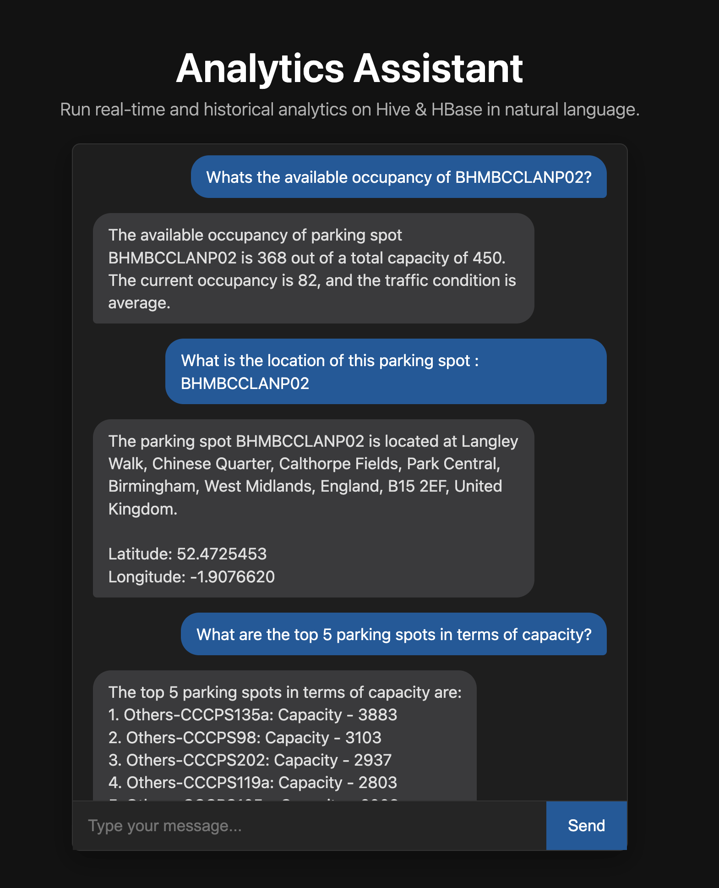

# Car Park Occupancy Chatbot and Ingestion Pipeline

This project provides a real-time data ingestion pipeline for car park availability and a chatbot interface to query this data using natural language.

The chatbot can be used for running analytics on Hive and Hbase tables in general, thus allowing for faster and easier analytics with natural language.

#### **For Big Data Application Architecture go [here](#kappa-architecture).**

#### **For Generative AI go [here](#agentic-ai-chatbot).**

#### For the complete picture, start reading from right here.



## Demo

### Demo on YouTube: [https://youtu.be/HOKYPr0L9zw](https://youtu.be/HOKYPr0L9zw)

[](https://www.youtube.com/watch?v=HOKYPr0L9zw)

## Resources

EMR Cluster For the Big Data Application Deployment:

```
ec2-34-230-47-10.compute-1.amazonaws.com
```

**Note:** I have completed the project on the old EMR cluster in which the Scala version got upgraded which broke the Spark Streaming jobs. Also, the HDFS data is still present for my tables so it can be queried fine. Therefore, the pipeline works without errors.

**Special Note:** I found an experimental workaround for submitting the spark streaming jobs without any errors for the demo.

Please run the following command to activate the python virtual environment before submitting the `spark-submit` jobs for your local runs. This is the environment for running the fake data producer in python which is discussed in detail in the later sections.
```
source /home/hadoop/ayaachi/kafka_code/.venv/bin/activate
```
Running the `spark-submit` with the Python virtual environment activated, allows for the Spark jobs to run without errors which would otherwise occur due to the spark version issue on the cluster.

The documentation refers to the code and the paths existing in EMR. For locally referencing the code, you can see the scripts in the following directories.

- Create Table Statements are in `ingestion/hbase` and `ingestion/hiv`e directories.
- Kafka Fake Producer and Topic creation scripts are in `ingestion/kafka_ingestion`
- The Kafka Consumer Spark Streaming code is in `car_park_kafka_ingestion/` directory.
- The chatbot code is in `chatbot/` directory.

# Kappa Architecture

## 1. Data Model & Schema

The system relies on HBase & Hive to manage real-time and historical car park information.

### Hive Tables

The Hive tables provide a SQL interface to the data. The schema for these tables is dynamically fetched by the chatbot.

#### `ayaachi_parking_data` (Raw Data Table)

This table consumes the record as it is including all columns from the source. It is an external table built on top of CSV files stored in HDFS.

Reason for CSV SerDe: Since the initial data load was with CSV files. It is imperative that we adapt our big data pipeline to work with CSV in the raw table.

Create Table statement for the raw data table
```
CREATE EXTERNAL TABLE IF NOT EXISTS ayaachi_parking_data (
  id INT,
  system_code_number STRING,
  capacity INT,
  latitude DOUBLE,
  longitude DOUBLE,
  occupancy INT,
  vehicle_type STRING,
  traffic_condition_nearby STRING,
  queue_length INT,
  is_special_day TINYINT,
  last_updated_date STRING,
  last_updated_time STRING
)
ROW FORMAT SERDE 'org.apache.hadoop.hive.serde2.OpenCSVSerde'
WITH SERDEPROPERTIES (
  "separatorChar" = ",",
  "quoteChar"     = "\"",
  "escapeChar"    = "\\"
)
STORED AS TEXTFILE
LOCATION '/ayaachi/data/'
TBLPROPERTIES ("skip.header.line.count"="1");
```

## Batch Layer

#### `ayaachi_parking_avail_data` (Batch Layer Main Analytical Table)

This table contains detailed historical and real-time parking data. All analytical queries should primarily use this table.

It uses ORC SerDE and is a Hive managed table which allows for better performance and compression.

This table processes the data from the raw table `ayaachi_parking_data` and stores the necessary columns with the appropriate datatypes.

For ex: It removes the `id`, merges the `date` and `time` column from string to a single `Datetime` type and casts the `int` and `float` types.

*It also adds a column `available_occupancy` which specifies the available parking spots using the formula `capacity - (occupancy + queue)`*

This table is used for analytical queries on historical data.

### Create table statement
```
CREATE TABLE IF NOT EXISTS ayaachi_parking_avail_data (
  id INT,
  system_code_number STRING,
  capacity INT,
  occupancy INT,
  available_occupancy INT,
  vehicle_type STRING,
  traffic_condition_nearby STRING,
  queue_length INT,
  is_special_day TINYINT,
  record_timestamp TIMESTAMP,
  latitude DOUBLE,
  longitude DOUBLE
)
STORED AS ORC;
```

The table can be updated by running this query using a cron job or a scheduler like `Oozie/Airflow` everyday.

### Updating Batch Layer Daily using HQL

```
INSERT INTO TABLE ayaachi_parking_avail_data
SELECT
    t1.id,
    t1.system_code_number,
    t1.capacity,
    t1.occupancy,
    (t1.capacity - t1.occupancy - t1.queue_length) AS available_occupancy,
    t1.vehicle_type,
    t1.traffic_condition_nearby,
    t1.queue_length,
    t1.is_special_day,
    from_unixtime(
        unix_timestamp(
            CONCAT(t1.last_updated_date, ' ', t1.last_updated_time),
            'dd-MM-yyyy HH:mm:ss'
        )
    ) AS record_timestamp,
    t1.latitude,
    t1.longitude
FROM
    ayaachi_parking_data t1;
```

## Speed Layer

### HBase Table

*   **`ayaachi_parking_availability_latest`**: Stores the latest, real-time data for each car park. This is the serving layer for low-latency lookups.

Create HBase table:
```
create 'ayaachi_parking_availability_latest', 'data'
```
The HBase table stores all the columns except the `record_timestamp` and the `vehicle_type` from the batch layer.

This is because the HBase table is used for low latency state query for the parking lots based on the parking lot id which is the `row_key: system_code_number`.

#### `ayaachi_parking_latest_hbase_map` (HBase Mapping Table)

This Hive table provides a SQL interface to the HBase table `ayaachi_parking_availability_latest`, allowing SQL queries on the latest data with a very low latency.

Create table statement for the HBase mapping table in Hive
```
CREATE EXTERNAL TABLE IF NOT EXISTS ayaachi_parking_latest_hbase_map (
  system_code_number STRING,
  capacity INT,
  occupancy INT,
  available_occupancy INT,
  queue_length INT,
  traffic_condition_nearby STRING,
  latitude DOUBLE,
  longitude DOUBLE
)
STORED BY 'org.apache.hadoop.hive.hbase.HBaseStorageHandler'
WITH SERDEPROPERTIES (
  "hbase.columns.mapping" = "
    :key,
    data:capacity,
    data:occupancy,
    data:available_occupancy,
    data:queue_length,
    data:traffic_condition,
    data:latitude,
    data:longitude
  "
)
TBLPROPERTIES (
  "hbase.table.name" = "ayaachi_parking_availability_latest",
  "hbase.map.column.to.key" = "system_code_number"
);
```
### One-time insertion into HBase

We can use this query to rebuild our speed layer in case of failure. This query is used for initial loading of data from our batch layer - `ayaachi_parking_avail_data` table

```
INSERT OVERWRITE TABLE ayaachi_parking_latest_hbase_map
SELECT
    t.system_code_number,
    t.capacity,
    t.occupancy,
    t.available_occupancy,
    t.queue_length,
    t.traffic_condition_nearby,
    t.latitude,
    t.longitude
FROM (
    SELECT
        system_code_number,
        capacity,
        occupancy,
        available_occupancy,
        queue_length,
        traffic_condition_nearby,
        latitude,
        longitude,
        record_timestamp,
        ROW_NUMBER() OVER (
            PARTITION BY system_code_number
            ORDER BY record_timestamp DESC
        ) as rn
    FROM
        ayaachi_parking_avail_data
) t
WHERE t.rn = 1;
```

## 2. Spark Streaming Ingestion Pipeline

The initial loading of data is done through a `csv` file into the raw table. Once we have the initial load done we only update the batch layer table `ayaachi_parking_avail_data` using the HQL query defined in the above section.

### Kafka (Primary Source)

*Kafka Topic: `ayaachi_car_park`*

For the `HBase` real-time updates and updating the raw data table `ayaachi_parking_data` we use `Kafka` as our primary source.

Create the Kafka topic by running the script in
```/home/hadoop/ayaachi/kafka_code/create_topic.py```

Run the following -
```
cd /home/hadoop/ayaachi/kafka_code
python -m venv .venv
source .venv/bin/activate
pip install -r requirements.txt
python create_topic.py
```

### Kappa Architecture

The ingestion pipeline uses a dual-path Spark Streaming application designed to ingest real-time JSON data from Kafka into both HBase and Hive/HDFS.

Kappa architecture is appropriate for this pipeline as the initial data load is from a CSV dataset in Kaggle and we don't have a real-time data ingestion source. So, we fake the data using a Python producer. The way the ingestion is handled with Spark is discussed below.

### 2.1 Ingestion Architecture Overview

The pipeline implements a Kappa approach, utilizing two independent streaming jobs reading from the same Kafka topic - `ayaachi_car_park` to update both the raw data table in hive - `ayaachi_parking_data` and real-time data in HBase - `ayaachi_parking_availability_latest`

#### Ingestion Paths

| Path         | Scala Class             | Target Data Store                                   | Purpose                                                                                             | Data Processing                                                              |
| :----------- | :---------------------- | :-------------------------------------------------- | :-------------------------------------------------------------------------------------------------- | :--------------------------------------------------------------------------------- |
| Speed Layer  | `CarParkHBaseIngestion`   | HBase Table (`ayaachi_parking_availability_latest`)   | Real-Time Lookups: Provides the current status of the car parking including occupancy, availability, etc. for fast application serving. | Calculates Adjusted Available Occupancy, maps JSON to HBase columns, and performs PUT operations. |
| Batch Layer  | `CarParkHiveIngestion`    | Hive External Table (`ayaachi_parking_data`)          | Historical Archive: Stores every raw JSON record as an immutable CSV file for auditing and historical analytics. | Parses raw JSON, converts to CSV format, and writes to HDFS.                       |

#### Core Calculation

The primary metric, Adjusted Available Occupancy, is calculated by the streaming job based on the current state and demand:

$$\text{Available Occupancy} = \text{Capacity} - \text{Occupancy} - \text{QueueLength}$$

### 2.2 Jar Configuration

The Uber Jar and the consumer properties file is present in
```
/home/hadoop/ayaachi/jars
```
An example `consumer.properties` file looks like this -
```
# CONFIGURATION FOR SPARK JOB
bootstrap.servers=boot-public-byg.mpcs53014kafka.2siu49.c2.kafka.us-east-1.amazonaws.com:9196

# SECURITY CONFIGURATION (From kafka.client.properties)
security.protocol=SASL_SSL
sasl.mechanism=SCRAM-SHA-512
sasl.jaas.config=org.apache.kafka.common.security.scram.ScramLoginModule required username=${SECRET}$
password=${SECRET$};
ssl.truststore.location=/usr/lib/jvm/java-11-amazon-corretto.aarch64/lib/security/cacerts
ssl.truststore.password=${SECRET}

# CONSUMER CONFIGS
group.id=ayaachi_hbase_cg
request.timeout.ms=20000
retry.backoff.ms=500
```

Consumer Groups
```
HBase Ingestion Spark Job: ayaachi_hbase_cg
Hive Ingestion Spark Job: ayaachi_hive_cg
```

### 2.3 Execution of the Spark Streaming Jobs

Both jobs must be submitted separately and run concurrently. This ensures that in case of failure of either we can separately restart it and consume the data from the last consumed offset.

 Ensure your Uber JAR (`uber-car_park_kafka_ingestion-1.0-SNAPSHOT.jar`) is built and accessible.

The Jar is present in `/home/hadoop/ayaachi/jars`

`cd /home/hadoop/ayaachi/jars`

#### **Important Note**

Before running the `spark-submit` commands provided below, please activate this Python virtual environment using the following command. This is a workaround for the issues that developed in the original (older) EMR cluster due the Scala version issues.

```
source /home/hadoop/ayaachi/kafka_code/.venv/bin/activate
```

#### Batch Ingestion

A. Start the Hive Ingestion Job (Batch Ingestion)

This job writes raw CSV files to HDFS every 5 minutes.

```bash
spark-submit --class CarParkHiveIngestion --master local[1] uber-car_park_kafka_ingestion-1.0-SNAPSHOT.jar consumer_hive.properties
```
#### Real-Time Ingestion

B. Start the HBase Ingestion Job (Speed Layer)

This job performs low-latency updates (PUTs) to the HBase table every 5 seconds.

```bash
spark-submit --class CarParkHBaseIngestion --master local[1] uber-car_park_kafka_ingestion-1.0-SNAPSHOT.jar consumer_hbase.properties
```

### 2.4 Querying and Verification

A. Speed Layer Verification (HBase)

Use the HBase Shell for the lowest latency lookup of the current state, using the `system_code_number` as the Row Key.

Test Query (HBase Shell):

```bash
hbase shell
hbase(main):001:0> get 'ayaachi_parking_availability_latest', 'BHMBCCMKT01'
```

The timestamp should tell the latest record time.

B. Batch Layer Verification (Hive/HDFS)

The Hive table (`ayaachi_parking_data`) contains all historical records, but its metadata requires maintenance since new files are added

1. HDFS Metadata Repair

The Spark job is dropping new CSV files into HDFS. Hive needs to be explicitly told to scan the directory and register these new files. If new data is not visible in Hive, run this command:

```sql
MSCK REPAIR TABLE ayaachi_parking_data;
```
This command can be run through a scheduler daily to make sure that the new data is visible.

2. Query for Latest Records in Hive

Test Query (Hive/Spark SQL):

```sql
SELECT
    system_code_number,
    occupancy,
    capacity,
    last_updated_date,
    last_updated_time
FROM
    ayaachi_parking_data
ORDER BY
    UNIX_TIMESTAMP(
        CONCAT(last_updated_date, ' ', last_updated_time),
        'dd-MM-yyyy HH:mm:ss'
    ) DESC
LIMIT 10;
```

Expected Result: Records showing timestamps corresponding to the current time, confirming successful end-to-end ingestion.

### Mock Data Creation For Kafka
Since, the the data is from Kaggle, we only have the initial CSV file for loading the data. For further ingestion we have a mock data producer in Python which can be run with realistic values, configured by the constants defined on the top of the file.

Run the Kafka Producer -
```
cd /home/hadoop/ayaachi/kafka_code
python -m venv .venv
source .venv/bin/activate
pip install -r requirements.txt
python fake_producer.py
```

By default it produces a record every 5 seconds until 200 records are produced.

# Agentic AI Chatbot

## 3. Analytics Assistant

The Agentic AI Chatbot provides a natural language interface for running analytical and online queries on Hive & Hbase. It can identify relevant tables, form the correct query and run it against Hive/HBase tables. It can answer user queries in natural language and provide analytical answers back to the user by analyzing the data from the tables.

For this project, the application has context on **Car Parking Data** which is sourced through the Big Data Pipeline described in the previous sections. It can answer questions about the status of the car parkings and analyze the historical trends etc. for the car parkings.

### Demo on YouTube: [https://youtu.be/HOKYPr0L9zw](https://youtu.be/HOKYPr0L9zw)

## `LLM: GPT-3.5-Turbo`


### 3.1 Features

*   **Flask Backend:** A Python Flask application handles API requests and orchestrates interactions with the OpenAI model and data tools.
*   **UI:** A simple HTML/CSS/JavaScript frontend provides an interactive chat interface.
*   **Tool-Use Capabilities:** The chatbot leverages OpenAI's function calling to interact with HBase & Hive data sources.
*   **Retrieval-Augmented Generation (RAG):** Uses a local FAISS vector database to provide context from `.txt` documents, enhancing its ability to answer general questions about the system.
*   **Dynamic Schema Discovery:** Fetches live database schemas to ensure accurate SQL query generation.

### 3.2 Tools

The code for the tools is present in `chatbot/tools.py`

The chatbot uses the following custom tools:

*   **`get_relevant_tables()`**: Retrieves the schema (table names, columns, descriptions) for all available Hive tables from a local XML file. This is the first step for any Hive query.
*   **`query_hive(query: str)`**: Executes a SQL query against Hive.
*   **`query_hbase(table_name: str, row_key: str)`**: Fetches real-time data for a specific car park from HBase.
*   **`search_knowledge_base(query: str)`**: Searches the RAG knowledge base for relevant information.
*   **`get_location_from_longitude_latitude(longitude: float, latitude: float)`**: Converts geographic coordinates into a physical address.

### 3.3 Setup and Running the Chatbot

#### Prerequisites

*   Python 3.10.19
*   A virtual environment.
*   An OpenAI API Key (set as `OPENAI_API_KEY` environment variable).
*   Access to your Hive and HBase services (via SSH tunnel or direct network access).

#### Installation

1.  **Clone the repository:**
    ```bash
    git clone https://github.com/ayaachi-jha/car_park_occupancy.git
    cd car_park_occupancy
    ```
2.  **Create and activate a virtual environment:**
    ```bash
    python3.10 -m venv venv
    source venv/bin/activate
    ```
3.  **Install Python dependencies:**
    ```bash
    pip install -r chatbot/requirements.txt
    ```
4.  **Prepare RAG Knowledge Base:**
    *   Place your `.txt` documents in `chatbot/knowledge_base/`.
    *   Build the vector database:
        ```bash
        cd chatbot/
        python ingest.py
        ```
5.  **Prepare Hive Schema Metadata:**
    *   Ensure `chatbot/database_metadata/hive_schema.xml` exists and contains your table schemas.
    *   It should already exist for the car park data.

#### Running the Application

1.  **Set your OpenAI API Key:**
    ```bash
    export OPENAI_API_KEY="your_api_key_here"
    ```
2. **SSH tunnel the Hive and HBase to your local:**
    ```
    ssh -N -L 10000:localhost:10000 -L 9090:localhost:9090 hadoop@ec2-34-230-47-10.compute-1.amazonaws.com
    ```
3.  **Start the Flask server:**
    ```bash
    cd chatbot
    python app.py
    ```
4.  **Access the UI:** Open your web browser and go to `http://localhost:3030`.

### 3.4 Working of the Chatbot

The chatbot is an AI Agent that follows a structured workflow for answering user queries on analytical databases in natural language. It has the tools to query HBase and Hive and has the context on the table description to form the right queries and give the answers.

It can be provided with more workflows by adding `.txt` documentation in the `knowledge_base/` directory which is a source for creating the vector database for RAG.

The core logic is orchestrated by a Python Flask backend, which manages the entire lifecycle of a user's query.

#### Request Handling and Core Loop

1.  **API Endpoint**: All user interactions are sent to the `/api/chat` endpoint of the Flask application. The request contains the conversation history.
2.  **System Prompt**: For a new conversation, a detailed `SYSTEM_PROMPT` is prepended to the message history. This prompt instructs the AI model on its role as a data analyst, outlines the mandatory workflows for querying data, and defines the rules it must follow.
3.  **Model Invocation**: The backend sends the complete message history (including the system prompt) to the OpenAI API.
4.  **Tool-Use Loop**: The model doesn't just generate text, it decides if it needs to use a tool to answer the question.
    *   If the model determines a tool is necessary, its response will contain a `tool_calls` object specifying the function to call (e.g., `query_hive`) and the arguments (e.g., a SQL query).
    *   The Flask backend executes the specified function.
    *   The function's return value (e.g., query results from Hive) is packaged into a "tool" message and sent back to the model in a new API call.
    *   This loop continues until the model has all the information it needs.
5.  **Final Response**: Once the model has gathered sufficient information from the tools, it generates a final, human-readable answer. The backend receives this as a standard text response and forwards it to the user interface.

#### Critical Workflow for Hive & HBase Queries

To ensure accuracy and prevent errors when dealing with complex analytical queries, the chatbot is programmed to follow a strict, multi-step workflow for all Hive-related questions:

1.  **Step 1: Retrieve Query Examples (RAG)**: The model first calls the `search_knowledge_base` tool. It uses keywords from the user's query to search a FAISS vector database containing a "query cookbook." This step provides the model with proven query patterns and examples, guiding it on how to structure complex SQL.
2.  **Step 2: Discover Schema**: Next, the model calls `get_relevant_tables()`, which reads a local XML file (`hive_schema.xml`) containing the complete, up-to-date schemas for all Hive tables. This ensures the model never hallucinates table or column names.
3.  **Step 3: Construct the Query**: Using the context from the cookbook examples and the live schemas, the model constructs a precise and syntactically correct HiveQL query.
4.  **Step 4: Execute the Query**: The model then calls the `query_hive` tool, passing the generated SQL query to be executed against the Hive database or query the HBase using `query_hbase` tool by parsing the `row_key` provided by the user.
5.  **Step 5: Synthesize the Answer**: Finally, the model analyzes the results returned and formulates an answer for the user.

This structured approach makes the chatbot robust, adaptable to schema changes, and capable of handling complex analytical tasks that would otherwise require a human analyst.

### 3.5 Features and the idea behind them

**1. RAG**

We need the RAG integration to ensure that we can provide the LLM context on different tables and the kind of data they store. This allows the LLM to grow smarter as more documentation/runbooks are added to the knowledge base, allowing it to query the tables on Hive/HBase more effectively. More than it also provides context on what kind of query to form.

**2. Fetch Relevant Tables Tool**

Initially the application had the fetch_hive_schema tool which allowed it to fetch the schema for a table. But it is very unpredictable to let the LLM decide which table's schema to fetch and sometimes the LLM would not fetch the schema and hallucinate the columns available thus forming an incorrect SQL query and throwing errors.

The Fetch Relevant Tables Tool allows the LLM to use this as a prerequisite step to first identify which table to query as it also provides the description and relevance of each table. Therefore, querying the right table with the right schema. This reduced the errors in querying Hive significantly.

**3. Query Hive Tool**

This tool allows the LLM to run queries on the Hive tables. It returns the results of the queries to the LLM as context, which allows the LLM to provide insightful and data-backed answers to the users' queries.

Therefore, it can run complex analytics just through natural language inputs.

**4. Query HBase Tool**

The reason is similar to Hive, but it provides a low-latency output for the LLM. For large Hive tables the LLM can be slow to respond due to the query runtimes, but with the context from the knowledge base it knows that realtime data can be queried from relevant HBase tables at low-latency. This allows the LLM to query HBase tables for real-time queries.

The benefit of segregating the two is that we are fully utilizing the LLM's capabilities to understand what kind of query needs to be run thus getting an efficient tool usage by the LLM.

**5. Mult-Tool Call Feature**

This is a part of chat handling, where the application enables the LLM to take the result of the tool call and then call tools again. The application keeps looping until the finishing reason for the LLM is not "stop" i.e. the LLM has generated the final response. This allows for a more in-depth analysis by the LLM before responding.

It also enables the users to define complex workflows through the knowledge base, like currently for running queries on Hive, it almost always searches the knowledge base, then fetches the relevant tables, and then queries the table, thus, using 3 tool calls in succession. This helps in providing accurate answers without any intermittent errors in running the queries on Hive.

**6. Future Work**

The application requires context management, especially context summarization to avoid context overflow errors. Also, we need a configuration to define the max rows to send to the LLM to prevent a large output query to overflow the context window.

---